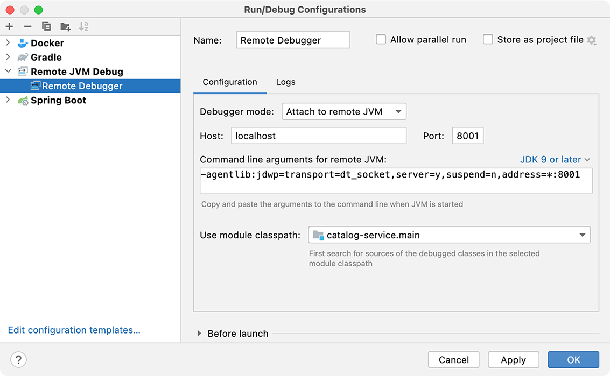

### 📖 Concurrency and Resiliency Patterns in Saga Transactions for Spring Boot Microservices

#### ✅ Saga Event Routing with Content Based Router, Outbox Pattern, Retryable Exceptions and DLQ Error Channel using Srping Cloud Stream, Kafka, Debezium and PostgreSQL
#### ✅ Retryable Exceptions and Dead-Letter Queue Error Channel with Spring Cloud Stream
#### ✅ Event Routing and Outbox Pattern with PostgreSQL, Debezium and Kafka
#### ✅ Handling Concurrency with Kafka Consumer Groups and Partitions + PostgresQL Optimistic Locking
#### ✅ Handling Resiliency with PostgreSQL Optimistic Locking and Retryable Exceptions
#### ✅ E2E Concurrency Testing Framework with Completable Futures using Spring Cloud OpenFeign

<ul style="list-style-type:disc">
    <li>📖 This <b>Order Processing Platform with Spring Cloud Stream, Kafka, PostgreSQL and Debezium CDC Connect</b> is a full-stack example of complete, fully functional Local Docker Development Environment:</li>
    <li>📖 <b>Event-Driven Spring Boot Microservices</b> with Content-Based Event Router, Spring Cloud Stream, Kafka, Debezium CDC PostgreSQL Kafka Connect and Outbox Pattern</li>
    <li>📖 <b>Swagger UI Gateway</b> with Keycloak Authorization</li>
    <li>📖 <b>E2E Testing Service</b> with Spring Cloud OpenFeign REST Client</li>
    <li>📖 Local <b>Docker</b> Development Environment</li>
  <li>📖 Full <b>Technology Stack</b>:</li>
  <ul>
    <li>✅ <b>Swagger UI</b></li>
    <li>✅ <b>Spring Cloud OpenFeign</b></li>
    <li>✅ <b>Spring Boot</b></li>
    <li>✅ <b>Spring Cloud Stream Event Routing</b></li>
    <li>✅ <b>Spring Cloud Gateway</b></li>
    <li>✅ <b>Event-Driven Microservices</b></li>
    <li>✅ <b>Kafka Event Streaming</b></li>
    <li>✅ <b>Event Routing Saga with Outbox Pattern, Kafka, Debezium and PostgreSQL</b></li>
    <li>✅ <b>Content Based Router with Message Headers using Spring Cloud Stream</b></li>
    <li>✅ <b>Debezium Change Data Capture PostgreSQL Kafka Connect</b></li>
    <li>✅ <b>Reliable Event Routing and Outbox Pattern Saga Transactions with Kafka, Debezium and PostgreSQL</b></li>
    <li>✅ <b>Safe Idempotent Retry Transactions with Optimistic Locking and Spring Cloud Stream Retryable Exceptions</b></li>
    <li>✅ <b>Kafka UI</b></li>
    <li>✅ <b>Lookup Tables for Safe Idempotent Retries with Correlation ID using Spring Cloud Stream Message Headers and PostgreSQL Database</b></li>
    <li>✅ <b>Keycloak Oauth2 Authorization Server</b></li>
    <li>✅ <b>Local Docker Environment</b></li>
    <li>✅ <b>E2E Testing Framework</b></li>
    <li>✅ <b>E2E Concurrency Testing with Completable Futures</b></li>
    <li>✅ <b>Remote Debugging</b></li>
    <li>✅ <b>Debezium Kafka Connect</b></li>
    <li>✅ <b>Debezium Outbox Event Router</b></li>
  </ul>
</ul>

### 📖 Links

- [Demo Saga Pattern, Outbox Pattern using Spring Boot, Debezium, Kafka, Kafka Connect](https://github.com/uuhnaut69/saga-pattern-microservices)
- [Stock Tracking Platform with Outbox Pattern, Kafka Event Streaming, Debezium CDC Connector and PostgreSQL](https://github.com/skyglass/stock-tracking-03)
- [Video Streaming Platform with Debezium CDC Kafka Connector, Kafka Event Streaming, Minio File Storage and FFmpeg Video Processing](https://github.com/greeta-video-01/video-api)
- [E2E Testing Pipeline for Spring Boot Microservices using OpenFeign Client and Github Actions](https://www.linkedin.com/pulse/e2e-testing-pipeline-spring-boot-microservices-using-openfeign/)

### 📖 Step By Step Guide

#### Local Docker Environment Setup:

- (1) this script will rebuild spring boot docker images and start docker environment with your latest code changes:

```
(1) sh docker-start.sh
```

- (2) this script will rebuild spring boot docker image for `order` aplication and restart
  application with rebuilt image (replace `order` with the name of the application
  you want to rebuild and restart):

```
(2) sh docker-app-restart.sh order
```

- (3) this script will restart all spring boot applications without rebuilding docker images:

```
(3) sh docker-app-all-restart.sh order
```

- (4) this script will restart all docker environment without rebuilding docker images

```
(4) sh docker-restart.sh order
```

#### Local Docker Environment E2E Testing:

- make sure you started local docker environment with `sh docker-start.sh` command

- run `sh register-connectors.sh` (Debezium Kafka PostgreSQL connectors)

- Open `Kafka UI` and make sure that all 3 Kafka Connectors are running and connected to topics (see `Kafka UI` section)

- go to `e2e-service` and run each test separately in your IDE

- Warning! In case of any problems with E2E Tests or Docker Environment, see `Docker Troubleshooting` section

- Use `PostgreSQL` Database Client (for example DBeaver) to monitor `customer` `order` and `inventory` databases

- Warning! Before each E2E test, PostgreSQL Tables and Kafka Topics are completely reset: all data is clean before running each E2E Test

- For E2E REST API requests OpenFeign uses  `admin/admin` password credentials (it receives `access_token` from Keycloak Server using `password` grant type)

- Make sure that Keycloak Server is running as part of your Local Docker Environment: http://localhost:8080 (otherwise OpenFeign REST API authorized requests will not work)


### Docker Troubleshooting

- In case of any problems, start crashed spring boot containers again:

```
docker-compose -f docker-app-compose.yml up -d
```

- In case the tests still fail, try to restart all spring boot containers:

```
docker-compose -f docker-app-compose.yml down
docker-compose -f docker-app-compose.yml up -d
```

- In case you still have problems, try to restart all docker containers:

```
sh docker-restart.sh
```

- In case you still have problems, delete `volumes` folder
 and use the following commands to cleanup all docker resources and rebuild all docker images:

```
sh docker-destroy.sh
docker volume prune
docker system prune
sh docker-start.sh
```

### Remote Debugging

- Use `BPL_DEBUG_PORT` property in `docker-app-compose.yml` for remote debugging port of the spring boot application (see `Port` in the screenshot)
- Select Spring Boot Application from the dropdown list (see `Use module classpath` in the screenshot)



#### Kafka UI

- Kafka UI should be available here: http://localhost:8070/
- Go To `Kafka Connect` and Make sure that all 3 Kafka Connectors are running and connected to topics (`Topics` and `Status` columns of each connector)
- Use `Kafka UI` to monitor Topics, Kafka Connectors, Producers, Consumers and Event Messages:
- You can browse topics, partitions, messages and other kafka resources using this console

### Swagger UI

- Open http://localhost:9000 in your Browser and make sure that Swagger UI is working
- For Swagger UI `POST` requests: click `Authorize` and use `admin/admin` or `user/user` for credentials (`clientId` should be `stock-app`)
- Warning! Sometimes switching between Swagger UI pages doesn't refresh Swagger UI completely and you might see wrong REST endpoints: just refresh the page and continue
